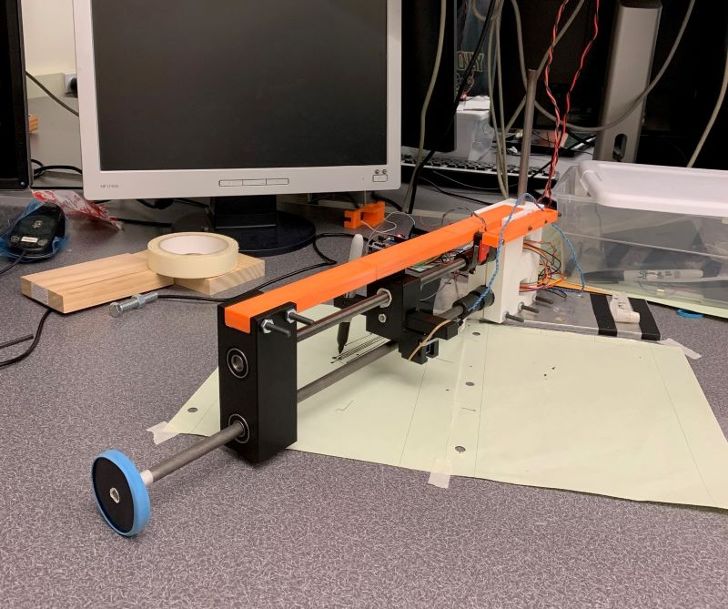
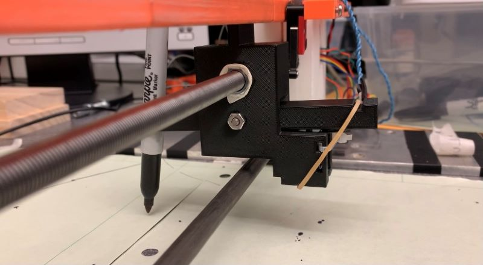
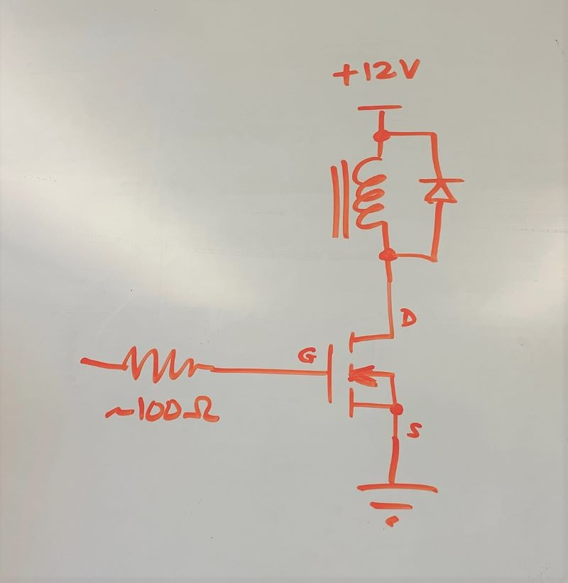
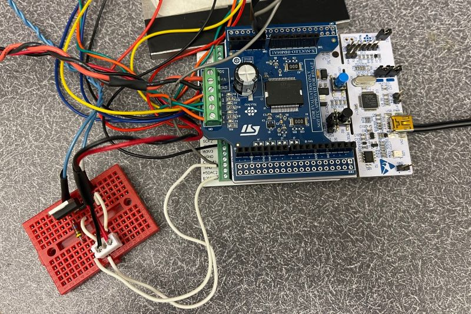

# PlotSomething

Figure 1. System Overview

## Introduction

Our device is a pen plotter system that automatically plots an image through the use of an hpgl file. Through a serial terminal window, 
the user is initially prompted to calibrate the pen. Next, the user presses ‘p’ to plot, ‘q’ to quit, and ‘h’ to return to the welcome screen. 
After pressing ‘p’ to plot, the user is prompted to enter a hpgl filename. Once that is completed, the device will start to read the hpgl file 
and plot as the program reads each coordinate. If this filename doesn’t exist in the folder, it will prompt a message that says, 
“invalid file name”. This device is meant for people who are able to convert their desired image into an hpgl file and for those 
who want to plot something on paper without having to draw it themselves. This device is also for people who don’t want a typical, 
boring printed image on a piece of paper.

## Hardware Overview

The following table displays all of our hardware components used in this project. Fasteners such as screws, bolts, and nuts are not listed.

| Part No.  | Part                              |  Qty. | Source            |
|:---------:|:----------------------------------|:-----:|:------------------|
|    1      | 2-in Drive Wheel                  |   1   | 3-D Printed       |
|    2      | Track Slider/Solenoid Carrier     |   1   | 3-D Printed       |
|    3      | Lever Arm/Pen Carrier             |   1   | 3-D Printed       |
|    4      | Motor Mount                       |   1   | 3-D Printed       |
|    5      | T-Slot Framing Rail               |   1   | 3-D Printed       | 
|    6      | Drive Shaft and Lead Screw Mount  |   1   | 3-D Printed       |
|    7      | Limit Switch Mount                |   1   | 3-D Printed       | 
|    8      | Metal Base Plate                  |   1   | ME405 Lab         |
|    9      | Base Shaft                        |   1   | ME405 Lab         |
|    9      | 3/8 in Drive Shaft                |   1   | Home Depot        |
|    10     | 3/8 in-24 Threaded Rod            |   1   | McMasterCarr      |
|    11     | 3/8 in-24 Hex Nut                 |   1   | Home Depot        |
|    12     | DC Voltage Limit Switch           |   1   | Amazon            |
|    13     | Solenoid (5V, 1.1A)               |   1   | Amazon            |
|    14     | Roller Bearing                    |   5   | Amazon            |
|    15     | Set Screw Shaft Coupling          |   2   | McMasterCarr      |
|    16     | Black FinePoint Sharpie&trade;    |   1   | Campus Bookstore  |
|    17     | Rubber Band                       |   2   | Home              |
|    18     | Nucleo with Shoe	                |   1   | ME405 Tub         |
|    19     | Mini Breadboard	                |   1   | ME405 Tub         |
|    20     | P40NF03L MOSFET	                |   1   | IEEE Campus Store |
|    21     | 1N4004 Diode	                |   1   | ME405 Lab         |
|    22     | 5 Ohm Resistor                    |   1   | ME405 Lab         |

Our pen plotter project uses a cylindrical axis system that has one axis of rotation at the base shaft:
- Theta: A drive shaft rotates using the torque from a motor connected to a drive wheel.
- Radial: A lead screw moves the pen radially using the torque from a second motor.

The vertical base shaft rotates about the center of axis of rotation by being press-fit into a roller bearing, 
which was press-fitted into a metal plate that sits on the tabletop.

We 3-D printed a mount to keep both motors stationed close to the base shaft. The two motors are connected 
to a drive shaft and a lead screw using set screw shaft couplings. Since the motors don’t have enough torque 
to drive the entire system, we created a larger torque by incorporating a drive wheel. This drive wheel was 
3-D printed, and a rubber band was wrapped around the diameter of the wheel to provide friction when it contacts 
the table. The drive wheel was press-fitted into the drive shaft, and masking tape was used to create a tighter fit. 

As the lead screw nut undergoes translational motion, we ensured that the lead screw did not rotate by incorporating a 
slider mechanism. Using a 3-D printed part that acts as a T-Slot framing rail, we 3-D printed a track slider to fit 
within the slot clearance. We designed this track slider to have the lead screw nut press-fitted inside, so as the lead 
screw rotates, the slider prevents any rotation around the lead screw. We used masking tape to ensure a tighter 
press-fit. See figure 2 below for reference.

Figure 2. Close-Up Shot of Track Slider and Lever Arm

The right side of the track slider part has a holder that secures the solenoid using a light press-fit and a zip tie. 
As seen in the figure above, the track slider has a lever arm mechanism attached to it. For our system, we incorporated 
a lever arm that holds the sharpie. We used a spacer, screw, washer, and nut to attach the lever arm to the center of 
the track slider, allowing the lever arm to rotate about the same axis as the lead screw. Once the solenoid is actuated, 
the solenoid will extend and hit the lever arm, causing the sharpie to slightly rotate along with the level arm. When 
the solenoid is not extended, the lever arm rotates back to its original horizontal position by use of the rubber band, 
which acts as a spring. This is how we controlled whether or not the pen stayed in contact with the paper. For hardware
parts used to set up our solenoid, we followed a circuit diagram provided by Dr. Ridgeley, as shown below.

Figure 3. Circuit Diagram

The figure above shows a supply voltage of 12 volts, but our solenoid was rated for 5 volts, so we used the lab's power supply 
to provide 5 volts instead of 12 volts. In addition, we used a 5 ohm resistor instead of a 100 ohm resistor.

The picture below shows our implementation of the circuit diagram using a MOSFET, resistor, diode, and wires connected 
to the solenoid and power supply.

Figure 4. Circuit Setup

The final hardware component was a limit switch that was used to calibrate our system. The limit switch output was read with
a analog pin that allowed us to zero the encoders and identify when the pen reached the origin. We secured the limit switch
to the T-slot framing rail using screws and nuts and repurposing a previous iteration of our 3-D printed lever arm.

## Software Overview

As mentioned in the introduction, the software consists of a user interface that waits for user input to transition
between states. This user task is ran simultaneously with two motor tasks that continuosly sets the setpoint of the
controllers, sets the duty cycles of the motors, reads from the encoders, and runs the controllers themselves. The
tasks were added to a task manager run by the cotask file provided by Dr. Ridgely. The cotask file allows parallel
multitasking with the implementation of priorities so that some task will run before others. The
initial plan was to use queues to communicate the points from the hpgl file to the motor tasks and the controller.
However, the timing between each point became a concern. To solve this issue and to avoid issues that were caused
by the queues themselves a driver was created to read values from the hpgl output sequencially using a seperate
variable. Conceptually, this idea of running the controller and setting a flag to true when the encoder reading
was within the desired tolerance of the set point was possible. Then getting the next value from the driver would
be timed properly. Reflecting on it now, this design was used in an attempt to work around the queues that would
have provided this capability outright. The lasting issue was with the data allocation and handling the commands
in the form of characters rather than integers. If this project was continued queues would be implemented for the
communication between the motor tasks and the hpgl file that is read within the user task. The documentation for
the software can be accessed at the link below.

Software Documentation: https://cagena.github.io/PlotSomething/

## Results

We tested our system by creating an image and converting that to an hpgl file. From there, we found that our program couldn't properly read 
through all of the coordinates in the hpgl file. It read up to a certain coordinate and got stuck in our code somewhere. We ultimately 
ran out of time to debug, but we managed to get a curved line and straight line drawn on paper. Our system was successful in the sense that 
it was able to reach the first few coordinates, and the solenoid/pen/lever arm mechanism worked really well. The small solenoid was able to 
move the lever arm just enough for the pen to make contact with the paper. Our hardware seemed very robust, but we ran out of time to develop 
the software. The only downside of our hardware was the T-slot framing rail. We had to 3-D print this part last minute because the McMasterCarr 
part did not come in time. Most 3-D printers did not have a large enough print bed, so we had to split the rail into 3 sections and stick two rods 
through to connect all of them. This caused some raised edges, which did not provide enough clearance for the track slider to smoothly slide 
through on one of the sides. That affected our ability to properly calibrate the position of the pen, since it couldn't reach the limit switch.

If we could make some improvements to our system, we would use the aluminum T-slot framing rail from McMasterCarr or split up our 3-D printed framing 
rail into 3 sections in a different way (so that the track slider did not get caught near the base). Instead of having it split into 3 equal lengths, 
we would split it up so that the most important middle section was printed in one part, and the end sections were printed separately. In addition, we 
would figure out a way to implement a second limit switch for the rotation of the drive shaft and drive wheel. This way, we can calibrate our theta value 
to consistently plot from a selected origin every time our program ran. We would also try to figure out a different design that doesn't use the rubber 
band as a spring for our lever arm mechanism. If the rubber band is consistently used, the wear and tear of it will prevent the springing action we need 
to return the lever arm to a horizontal position.

We learned that focusing on hardware and software at the same time was very challenging, since one could not be fully tested without the other. 
The time constraint of this project ultimately caught up to us, especially since our McMasterCarr part did not come in time. In addition, we found it 
difficult to put the hardware together, since we did not have direct access to a 3-D printer. Fortunately, our friends were very kind and 
helped us 3-D print parts for this project. In addition, designing the hardware, especially the 3-D printed parts, was very challenging since we used 
press-fits, and it took up time re-designing parts when they did not fit properly. We also struggled figuring out the solenoid because our initial MOSFET 
selection was not working properly, so we spent a lot of time trying to figure out what was going wrong. In the end, we bought a new MOSFET that was 
fitting for our use, and it worked well with our solenoid. 

Although it was a really challenging project, we learned a lot about hardware (fasteners, press fits), electronics (MOSFETs, solenoids, limit switches), and
coding (hpgl files, code pertaining to solenoids and limit switches). We also learned how to quickly adapt and handle issues as they came up. Overall, this 
project was a really valuable learning experience.

## Additional Links
CAD Files: https://github.com/cagena/PlotSomething/tree/main/SolidWorks

