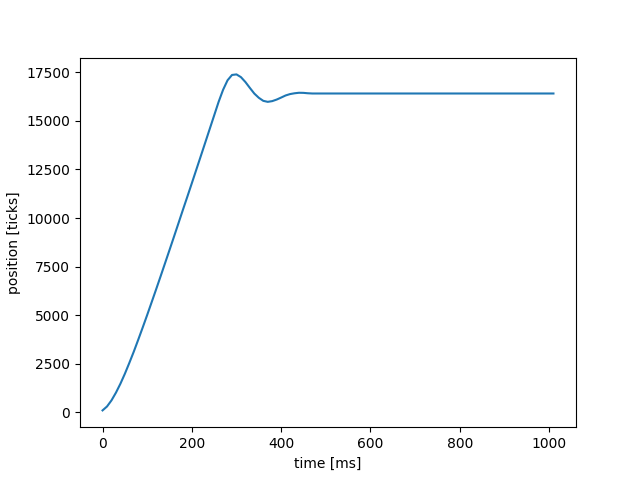
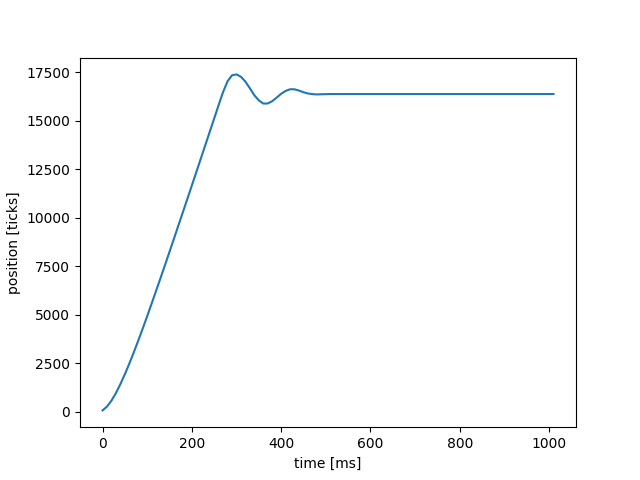

# Lab 2

Our closed loop controller moves the motor to a desired position that is defined through user input.
The proportional controller uses proportional gain values and error signals (the difference between
desired setpoint position and actual position sensed by the encoder) to essentially "correct" the motor duty cycle,
also known as pulse-width-modulation. The product of the control gain and error signal produces the actuation 
signal that is sent to the motor, which changes the magnitude and direction of torque. Our step response test 
system prompts the user to input a proportional gain value, K_p, then if inputs a value for the setpoint that
represents one rotation, 16384. Commented code is in the plot file to add a prompt for the user to input 
a setpoint value. One consideration when using the step response test is that on reset the plot may appear empty,
run the test again and the test will work properly.

The plots below depict our step response system using the following K_p values: 0.05, 0.1, and 0.15.

The figure below shows our step response using a K_p of 0.05.

**Figure 1. Plot of position[ticks] vs. time[ms]; K_p = 0.05.**

The plot above shows that there was not a lot of initial overshoot and very minimal oscillation in the response. 
However, it took about 300 ms for the system to stop at the end position, which is longer than the 
responses with higher gain values (as seen below).

The figure below shows our step response using a K_p of 0.1.

**Figure 2. Plot of position[ticks] vs. time[ms]; K_p = 0.1.**

As seen in the plot above, the plot has slight overshoot and slight oscillation. In comparison to figure 1 with a gain
value of 0.05, figure 2 with a gain value of 0.1 indicates that a higher gain value creates more oscillation in the system. 
Although there is more oscillation, the system responded a little bit faster in stopping at the end position.

The figure below shows our step response using a K_p of 0.15.

**Figure 3. Plot of position[ticks] vs. time[ms]; K_p = 0.15.**

The plot above shows the motor step response having some oscillation and slight overshoot. The time duration for this step 
response to reach the endpoint was about the same as the time duration for a K_p of 0.1. Compared to the previous two plots,
there is more oscillation in this system.

To conclude, we learned that increasing gain values increases oscillation and the time duration for the system to reach the
endpoint. Although step responses with higher gain values can reach the endpoint quicker, too high of a gain value can cause
a lot of oscillation, which will cause the system to take a longer time to reach the endpoint. The proportional gain value
that worked best for our system was a K_p value of 0.1.