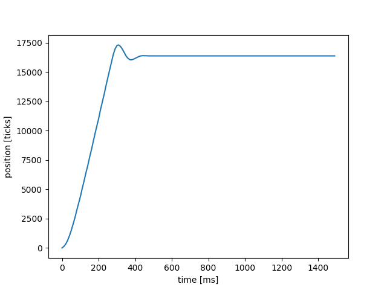
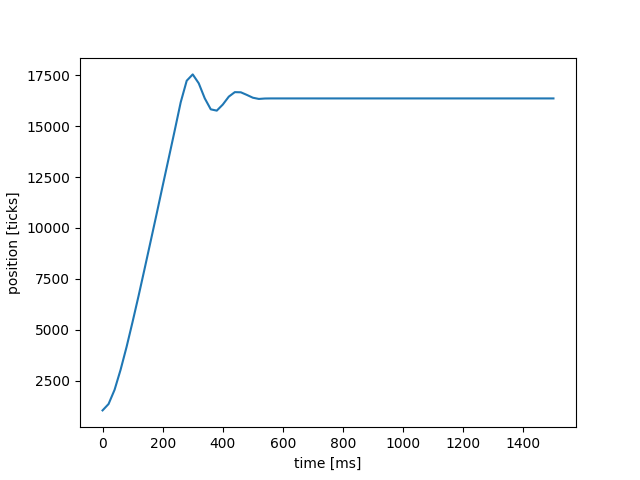
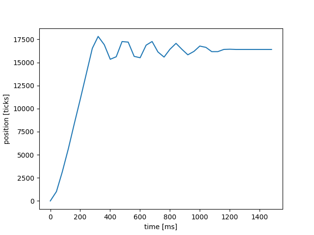

# Lab 3

Our closed loop controller moves the motor to a desired position that is defined through user input by utilizing
proportional gain values and error signals. Our step response test system prompts the user to input a proportional
gain value, K_p, then it inputs a value for the setpoint that represents one rotation, 16384. Commented code is in
the plot file to add a prompt for the user to input a setpoint value. One consideration when using the step
response test is that on reset the plot may appear empty, run the test again and the it will work properly.

Lab 3 adds three important files including: cotask.py, print_task.py, and task_share.py. The cotask file implements
a multitasking system to cooperatively run scheduled tasks. The task_share file allows the sharing of data across
files and avoids data corruption. The print_task file adds strings to a queue and prints them without blocking
other tasks. The implementation of tasks and the multitasking system allowed for the control of two motors 
simultaneously. Before the two motors were run the motor attached to a flywheel was tested to see how period
affected the response. Period being a new parameter used in the task manager.

The plots below depict our step response system using the following periods: 10, 20, 30, and 40ms.

The figure below shows our step response using a 10ms period.

**Figure 1. Plot of position[ticks] vs. time[ms]; T = 10ms.**

The plot above shows that there was not a lot of initial overshoot and very minimal oscillation in the response. 
At 10ms the result response is stable and steady state is reached in a short period of time.

The figure below shows our step response using a 20ms period.

**Figure 2. Plot of position[ticks] vs. time[ms]; T = 20ms.**

As seen in the plot above, the plot has more oscillation than the 10ms plot. Figure 2 shows that the response
is still stable and reaches steady state at a resonable time. However, the steady state value is lower and the 
plot is less smooth.

The figure below shows our step response using a 30ms period.

**Figure 3. Plot of position[ticks] vs. time[ms]; T = 30ms.**

The plot above shows the motor step response having more oscillation. The time duration for this step response
to reach the steady state was longer and the plot is much more rough. Compared to the previous two plots,
this response is undesirable.

The figure below shows our step response using a 40ms period.

**Figure 4. Plot of position[ticks] vs. time[ms]; T = 40ms.**

Figure 4 shows that the step response gets worse, this period shows that the difference between a good period and a
bad one can be drastic.

To conclude, we learned that increasing the period past 20 makes the response undesirable. With the data that
we found a good period is between 10ms and 15ms. This is where the time to steady-state, oscillation, and
smoothness of the plot is good.