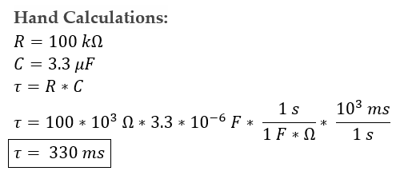
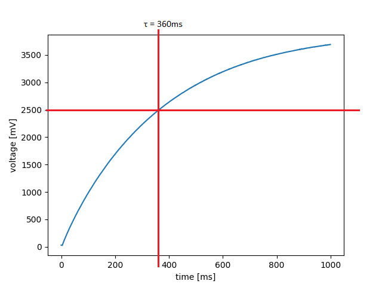
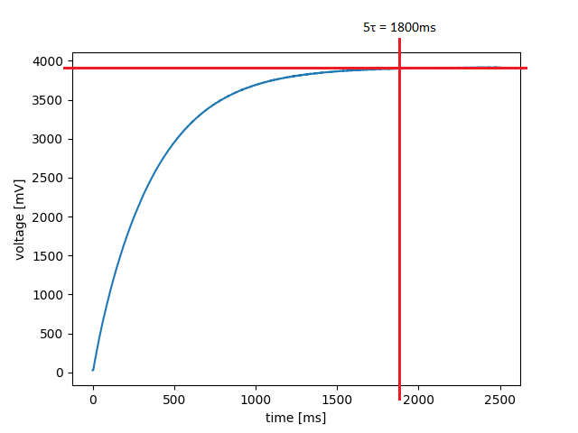
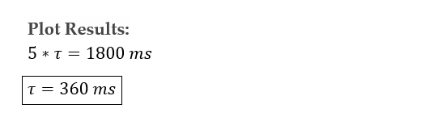
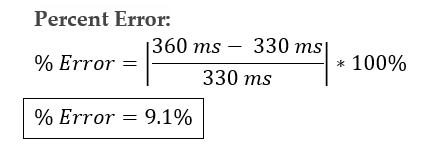

# Lab 4

Our main program performs a step response test of the RC circuit by reading a pin output and using the A/D converter to convert
analog data to digital, which represents the voltage across the 100kΩ resistor. The program uses an interrupt callback function to 
create interrupts at specified time intervals(in this lab, we created interrupts at a frequency of 1kHz) and putting the data 
into a queue. One consideration when using the step response test is that on reset the plot may appear empty, run the test again 
and then it will work properly.

Lab 4 uses three files including: main.py, plot_agena_chiu.py and task_share.py. The main file runs the step response 
for the RC circuit. The plot_agena_chiu file plots the voltage [mV] against time [ms]. The task_share file allows the sharing 
of data across files and avoids data corruption.

The hand calculations below show how the time constant was found.

The figure below shows the hand calculations for the theoretical time constant.

**Figure 1. Time Constant Hand Calculations.**

The plot above shows that using the theoretical values of the resistor and capacitor that we used. 

The figure below shows the step response of the system over a 1000ms period. The point of interest was found by
finding 63% of the theoretical steady state voltage of 4000mV.

**Figure 2. Plot of voltage[mV] vs. time[ms]; Step response over 1000ms.**

As seen in the plot above, time constant is about 360ms. The figure does not show the actual steady state value,
so another step response test was ran using a longer overall time.

The figure below shows the step response over 2500ms and measures 5 time constants by finding the time where 
the voltage is about 98% of 4000mV.

**Figure 3. Plot of voltage[mV] vs. time[ms]; Step response over 2500ms.**

The plot above shows that 5 time constants is approximately 1800ms. 

The figure below shows our quick calculation to find time constant from the plot.

**Figure 4. Hand Calculations for Time Constant from Plot.**

Figure 4 shows that the time constant is the same regardless of the method used to find it.

The figure below shows the percent error of the caculations compared to the theoretical value.

**Figure 5. Percent Error Hand Calculations.**

Figure 5 shows that the percent error of the time constant is less approximately 9%.

To conclude, we learned that interrupts are well suited for a fast response and accurate timing. However, we understand that it 
should be used sparingly due to its limitations in MicroPython coding. Through this lab, we found our measured time constant to be 
360 ms, while our theoretical calculations yielded a value of 330 ms. These results produced a percent error of about 9%, which 
falls into the expected tolerance for electronic components (5% to 25%). Therefore, we can conclude that the data from the 
step response of the RC circuit is valid.